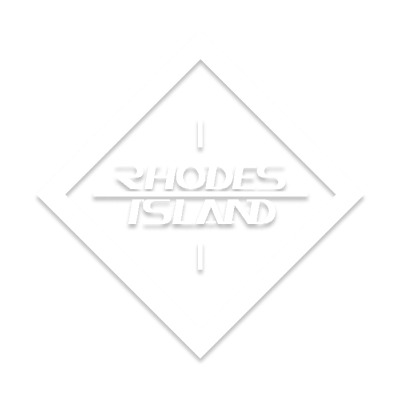

<h1 align="center"><y style="background: #FFD000; color: black; font-weight: bold">&#x205F;BETA&#x205F;</y> <b>P</b>rimitive <b>R</b>hodes Island <b>T</b>erminal <b>S</b>ervice. </h1>

    

This is just an another Arknights toolbox, built with Angular and was designed with UX in mind. 
This also serves as a study project for myself, to get better understanding about Angular and web dev in general.  

*Current version (main):* [`0.1.30b-121421`](https://github.com/sayuriu/prts/tree/master) 
*Latest beta:* `1.0.31b@030122:operators-page` 
[You can check the live site here.](https://beta.prts.tech) 
<b>WARNING!</b>: __*\*Note that it won't be displayed correctly on devices that have viewport size smaller than `1366px x 768px`.*__
